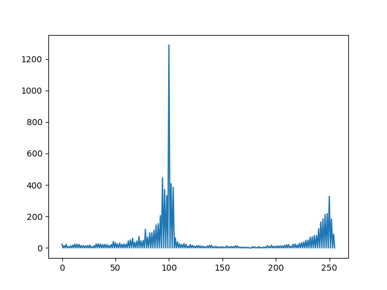

# Brain Tumor Edge Intensity Detection

Calculating the edge intensity requires original brain-MRI image of the patient and the 
exposed tumor region of the corresponding brain-MRI image. As the feature dynamics suggests, 
there are two types of tumors. Cloudy edges and Sharp edges. There are a few steps to be followed
to detect whether the tumor border is Cloudy or Sharp, and the steps are as follows.


> Note: Important: In order to calculate the edge intensity user requires brain tumor image in gray
scale and corresponding tumor mask of the brain tumor. And the tumor image should be contrast normalized.
> For histogram normalization refer "[createCLAHE](https://docs.opencv.org/4.6.0/d5/daf/tutorial_py_histogram_equalization.html)" in opencv.

#### Step 1 - Detecting the edge of the tumor using tumor mask


#### Step 2 - Edge dilation of the detected edge


#### Step 3 - Masking the tumor image with the dilated tumor border


#### Step 4 - Calculating the intensity gradient of the image

As the next step of the process, the separated edge region needed to separate as 
Cloudy or Sharp. For this colour, gradient change is used. To get the gradient 
first two steps of the Canny algorithm is followed, which are namely applying 
the gaussian filter and the calculating intensity gradients of the masked brain-MRI 
image. Next stage of the process is to analyze the pattern of the intensity gradients. 
Intensity gradients analyzed by plotting them into a histogram. Afterwards, the spread 
of the intensity of the two types of edges is analyzed using the intensity histogram. 
This result in two histograms as follows.



Two graphs give a clear idea about the spread of the intensity corresponding to the 
two types of edges. To calculate the spread of the graph standard deviation is used. 
A threshold value for the standard deviation is decided through the trial and error 
method by using many Cloudy and Sharp edge brain-MRI images.

```
histogram = cv2.calcHist([g.astype(np.uint8)], [0], None, [256], [128, 256])
list_data = np.array(g, dtype=np.float64)
std_deviation = np.std(list_data)
```

